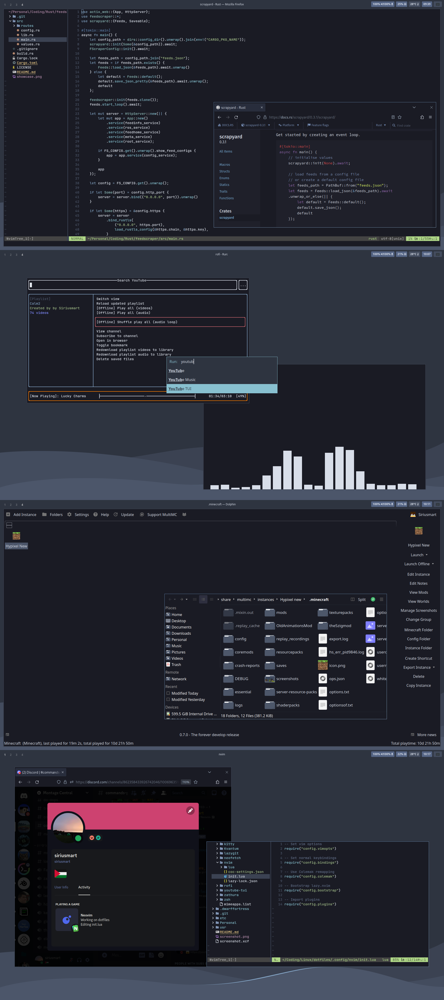

## Basic description

- This is my daily driver, running Arch with Hyprland + Waybar.
- Idles (after boot) with ~500MB memory usage, and 0% CPU like any systems should.
- Mainly Nord, but also include darker colours I made up which are not part of the Nord palette.

Here's everything that has been modified:

### btop++

- Removed forced background to respect terminal theme, that's it.

### Cava

- Increased smoothening and fps to 75 (my monitor refresh rate).
- Disabled auto sensitivity.

### Coc.nvim

- Includes a list of coc.nvim extensions I use in `extensions/package.json`.
- Coc will probably auto download the actual code of the extensions since they are not there.

### Dwarf fortress

- A soothing Dracular theme, credits to [likalium](https://github.com/likalium).

### Fcitx 5

- Darkish nord theme for the typing hint.

### Hyprland

- Large amount of bindings, check `bindings.conf` for details.
- Disabled most effects for minimalism and performance.

### Kitty

- Cool dark theme with JetBrains Mono (NerdFont).
- Full nord colors, from [connorholyday](https://github.com/connorholyday/nord-kitty/tree/master).

### Kvantum

- Dark nord theme for QT applications.

### Neovim

- Ahh yes, we can be here all day.
- But mostly, it is just a comfortable setup with Colemak-friendly keybindings.

### Neofetch

- Minimal neofetch theme from [Chick2D](https://github.com/Chick2D/neofetch-themes).

### Rofi

- Nord rofi theme taken from [newmanls](https://github.com/newmanls/rofi-themes-collection).

### SDDM

- Contains a theme called "nordic" even though it is from [catppuccin](https://github.com/catppuccin/sddm).

### Waybar

- Minimal config without a background: modified version of [Pigshag](https://github.com/Pipshag/dotfiles_nord)'s dotfiles.

### YouTube TUI

- Full nord colours.

### Zathura

- Recolours all PDFs to dark background for my eyes.
- Full nord colours.

### Zsh

- Barebones zsh config with minor improvements, such as aliases.
