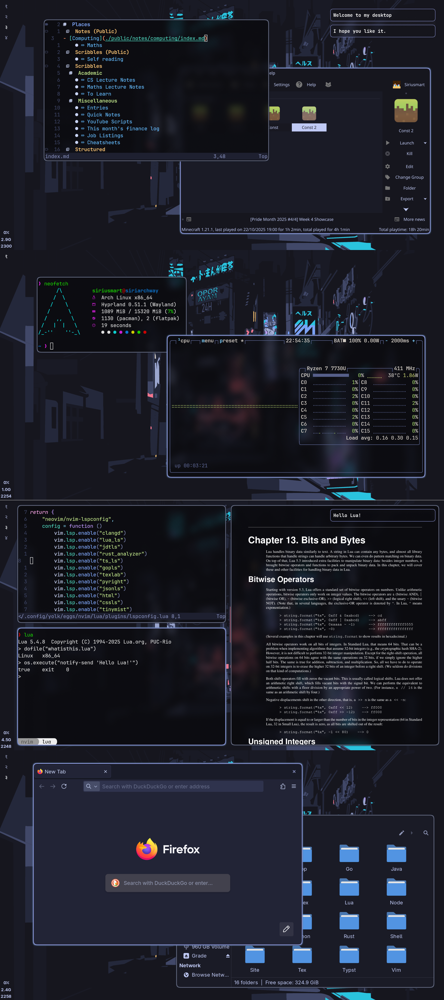

# WIP Hyprland Rice

My laptop screen is really inaccurate in terms of colours, since I did the config on it, the actual colours on screen are more muted than it is.

## Setup

Currently, its a "go figure it out yourself" dotfiles repo. However, you can use `yolk` to quickly put most of the stuff in the right place.
1. Set up rust.
2. `cargo install yolk_dots`
3. Git clone this repo to `~/.config/yolk`, make sure the branch is correct.
4. `yolk sync`

Then
- If you are using `rofi`, run the post deploy script at `~/.config/rofi/post_deploy.sh`
- If you are running `davinci-resolve`, copy the files in `~/.config/yolk/extra/applications` to `/usr/share/applications` because the AUR package used the wrong icon names.

## Apps with theme
- `btop`
- `hyprland` (requires `wayfreeze`)
- `hyprlock`
- `obs-studio` (with `pipewire-pulse` as dep)
- `kitty`
- `zsh` (requires `ttf-jetbrains-mono-nerd`, `zoxide` and `fzf`)
- `zathura`
- `rofi-wayland`, `rofi-calc`
- `wlogout`
- `nvim` (lspconfig is set up for a bunch of lsps, such as `lua-language-server` and `clangd` (part of the `clang` package)

## Dependencies for a lot of stuff
- `bc`
- `fzf`
- `noto-fonts`
- `mpv`
- `qt5-wayland`, `qt6ct`
- `papirus-icon-theme`

## Recommended (without theme)
- `thunar`
- `thunderbird`
- `systemd-numlockontty` (ofc)
- `reflector` and `preload`
- `keepassxc` and `syncthing` (latter is autostarted)
- `readest` (really nice ebook reader, or progress tracker if ur using `zathura` as your main reader)
- `blueman`
- `firefox`
- `fastfetch`
- `ly`
- `nmtui` (part of `networkmanager`)
- `thunar` (with `gvfs` as dep)
- `davinci-resolve` (with `pipewire-alsa` as dep)
- `gparted` (with `hyprpolkitagent` and `xorg-host` as dep, for some reason)
- `pavucontrol` (with `pipewire-pulse` as dep)
